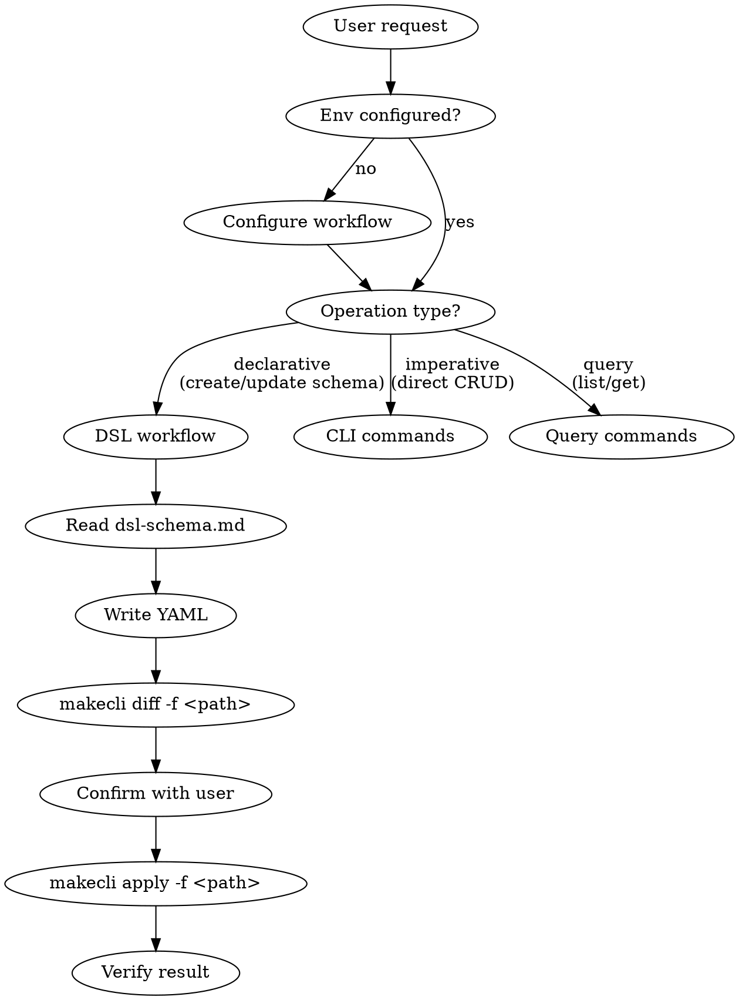

# makecli Claude Code Skill - Design Spec

## Overview

Create a Claude Code skill that teaches Claude how to use makecli to manage Make platform resources. The skill enables Claude to:

1. Guide users through environment configuration
2. Write correct DSL YAML files for Make platform resources
3. Use makecli CLI commands to deploy, diff, query, and manage resources
4. Manage record data through the Data API

## Structure

```
makecli/
  SKILL.md              — Main skill: triggers, workflows, decision tree (~200 lines)
  cli-reference.md      — Complete CLI command reference (~300 lines)
  dsl-schema.md         — DSL YAML schema reference (~400 lines)
```

## Trigger Conditions

- User explicitly requests Make platform operations (create app, deploy DSL, manage records, etc.)
- User invokes `/makecli` slash command

## SKILL.md Design

### Frontmatter

```yaml
---
name: makecli
description: "Use when the user asks to manage Make platform resources — create/deploy apps, entities, relations, records, write DSL YAML, or use makecli CLI commands. Also triggered by /makecli slash command."
---
```

### Content Sections

#### 1. Overview
One-line description: makecli is a CLI for the Make agentic development platform, managing Apps, Entities, Relations, and Records via Meta/Data Services.

#### 2. Pre-flight Check

```
1. Check ~/.make/credentials exists
   → No: guide user to run `makecli configure token`
2. Check current profile has token
   → No: guide user to run `makecli configure token --profile <name>`
3. If custom server-url needed:
   → guide `makecli configure config` or `makecli configure set server-url <url>`
```

#### 3. Decision Tree



#### 4. Workflow: Declarative Deployment (Primary Path)

Preferred over imperative commands when creating or updating schema resources (App, Entity, Relation).

Steps:
1. Read `dsl-schema.md` to understand YAML format
2. Write/modify DSL YAML file(s)
3. `makecli diff -f <path>` — preview changes
4. Confirm diff output with user
5. `makecli apply -f <path>` — deploy
6. Verify: `makecli entity list --app <name>` etc.

Key rules:
- apply processes resources in order: App → Entity → Relation
- apply uses create-or-update semantics (create if new, update if exists; App is create-only)
- Multi-document YAML (separated by `---`) supported
- Directory input scans one level for `.yaml`/`.yml` files

#### 5. Workflow: Imperative Operations

Use when:
- Single quick operation (e.g., delete one entity)
- Operations not supported by apply (e.g., record CRUD, app delete)
- User explicitly prefers command-style

Read `cli-reference.md` when unsure about exact flags/syntax.

#### 6. Workflow: Record Data Operations

Records are always managed imperatively (not via DSL/apply):

- Create: `makecli record create --app <app> --entity <entity> --json <file>`
- Get: `makecli record get <id> --app <app> --entity <entity>`
- List: `makecli record list --app <app> --entity <entity> [--fields ...] [--sort ...]`
- Update: `makecli record update <id> --app <app> --entity <entity> --json <file>`
- Delete: `makecli record delete <id> --app <app> --entity <entity>`

Batch operations: update/delete accept multiple record IDs.

#### 7. Workflow: Environment Configuration

Full configuration flow:
1. `makecli configure token` — set access token (JWT, masked input)
2. `makecli configure config` — set server-url, X-Tenant-ID, X-Operator-ID
3. `makecli configure set <key> <value>` — direct non-interactive config
4. `makecli configure get <key>` — read config value

Profile support: `--profile <name>` on all commands (default: "default").
Config files: `~/.make/credentials` and `~/.make/config` (INI format, 0600 permissions).

#### 8. Reference Loading Rules

| Scenario | Action |
|----------|--------|
| Need to write DSL YAML | Read `dsl-schema.md` |
| Unsure about CLI flags/syntax | Read `cli-reference.md` |
| Simple list/get/delete | Execute directly, no reference needed |

#### 9. Common Patterns

**From zero to deployed app:**
```
1. makecli configure token          # setup credentials
2. Write app.yaml with DSL          # define resources
3. makecli diff -f app.yaml         # preview
4. makecli apply -f app.yaml        # deploy
5. makecli record create ...        # add data
```

**Check what's on the server:**
```
1. makecli app list                 # list all apps
2. makecli entity list --app <app>  # list entities
3. makecli relation list --app <app># list relations
```

**Compare local vs remote:**
```
makecli diff -f <path> --output json  # machine-readable diff
```

---

## cli-reference.md Design

Complete CLI command reference organized by command group. Each command entry includes:
- Usage syntax
- Required and optional flags
- Input/output format
- Behavioral notes

### Sections

1. **Global Flags** — `--debug` (hidden, curl output to stderr), `--server-url`, `--profile`
2. **configure** — token, config, set, get
3. **app** — create, delete, list, init (with `--provider` options)
4. **entity** — create, delete, list (with `--json` field format)
5. **relation** — create, update, delete, list (with JSON from/to/cardinality format)
6. **record** — create, get, update, delete, list (with `--fields`, `--sort`, batch logic)
7. **apply** — `-f` file/dir, resource ordering, create-or-update semantics
8. **diff** — `-f` file/dir, output formats, exit codes (0=no diff, 1=diff found)
9. **update** — self-update from GitHub Releases
10. **version** — version display

### Notable Behaviors to Document

- apply resource ordering: App → Entity → Relation
- record update auto-routing: 1 ID → `/data/v1/record`, multiple IDs → `/data/v1/field`
- diff app inference: Make.App name > entity's app field > relation's app field
- All list commands support `--output table|json` and `--page`/`--size` pagination
- entity list with name argument shows detail view (fields table)
- relation list with name argument shows detail view (from/to details)

---

## dsl-schema.md Design

Complete YAML schema reference for Make platform DSL resources.

### Sections

1. **Base Resource Structure**
   ```yaml
   name: <string>
   type: Make.<ResourceType>
   app: <AppName>           # not for Make.App
   meta:
     version: <semver>
   properties: <type-specific>
   validations: <type-specific>  # optional
   ```

2. **Make.App** — properties: code, timezone?, description?

3. **Make.Entity** — properties.fields array of Make.Field definitions

4. **Make.Relation** — properties.from/to with entity + cardinality (one|many)
   - Cardinality combinations: 1:1, 1:N, N:M
   - FK placement rules: auto on `to` side for 1:1/1:N, join table for N:M

5. **Regular Field Types**
   - Text, TextArea, Number, Select, MultiSelect
   - Date, DateTime, DateRange
   - Percent, Currency, URL, File, ID
   - SingleUser, MultiUser (MultiUser supports `maxCount`, default 1000)
   - SingleDepartment, MultiDepartment (MultiDepartment supports `maxCount`, default 1000)
   - Each with properties + validations
   - Defaults: TextField `maxLength`=200; TextAreaField `maxLength`=2000

6. **Derived Field Types** (read-only)
   - Lookup — relation + targetField + filter (no transform; multi-value handling left to render layer)
   - Rollup — relation + relationField + expression (sum|avg|min|max|count)
   - Count — relation + filter
   - Formula — expression

7. **Validation Rules Table**
   - isRequired, isAlpha, isAlphanumeric, isJSON, isInt, isFloat
   - minLength, maxLength, minimum, maximum
   - matchRegexp — String regex pattern, e.g. `"^[a-z]+$"` (not a regex literal)
   - mustBeImage, mustBePDF, mustBeTextFile

8. **Expression Syntax**
   - Operators: arithmetic, comparison, logical, string concatenation
   - Functions: logic (IF, IFS, AND, OR), math (SUM, MAX, MIN, AVERAGE), text (LEFT, MID, RIGHT, CONCATENATE), date (TODAY, DATEDIF, DATETIME_DIFF), type (VALUE)

9. **Views** — Grid, Form, Kanban (schema + examples)

10. **Complete Example** — Full 1:N project-task app with App + 2 Entities + Relation + Lookup fields

### Field Naming Constraints
- Cannot start with `_` (reserved for system fields: `_id`, `_rel_*`, `_jt_*`)

---

## Key Design Decisions

1. **Declarative-first**: Skill prioritizes DSL YAML + apply/diff over imperative commands, because it's safer (diff before apply) and more reproducible.

2. **Reference on-demand**: Large reference content in separate files, loaded only when needed, to minimize token usage on simple operations.

3. **Pre-flight check**: Always verify environment before executing commands, to avoid cryptic auth errors.

4. **No auto-execution of destructive operations**: delete commands always require user confirmation context (the skill doesn't add extra confirmation — that's Claude's default behavior — but it doesn't bypass it either).

5. **Record operations are imperative-only**: apply/diff only handle schema resources (App, Entity, Relation), not data records.
